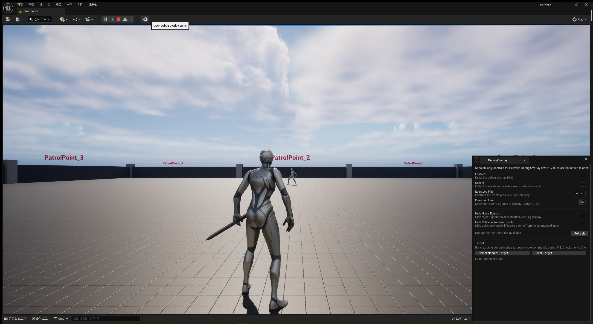
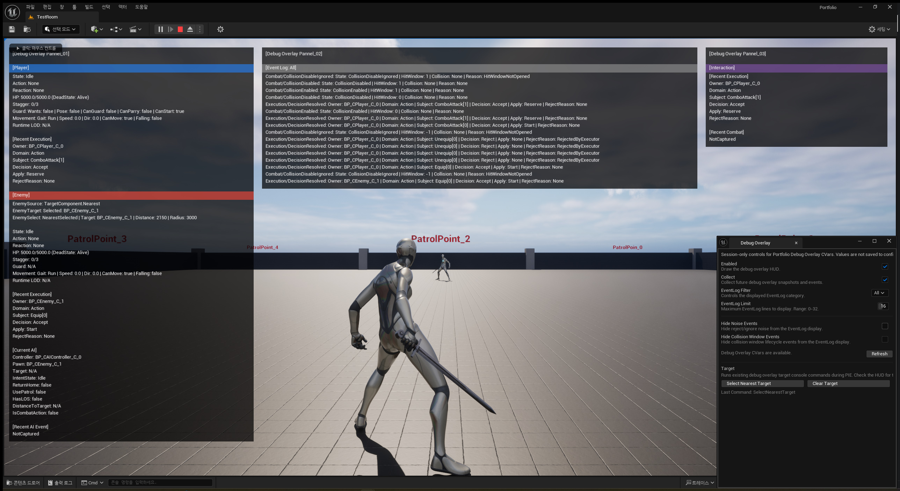
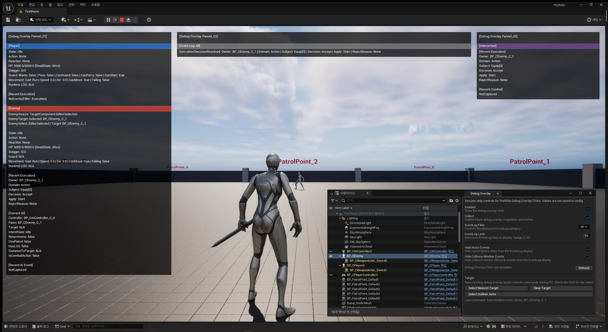

# UE5 Portfolio Pull Request

## 제목

**P53: Debug Overlay Editor Tooling**

## 날짜

**2026.08.02**

## 상태

- [x] Debug Overlay Editor Tooling 조사 문서화
- [x] `PortfolioDebugOverlayEditor` Editor-only plugin 추가
- [x] Level Editor toolbar button 추가
- [x] `창 > Portfolio Tools > Debug Overlay` menu entry 정리
- [x] `Debug Overlay` Nomad settings panel 추가
- [x] Debug Overlay CVar read/write UI 추가
- [x] `Select Nearest Target` / `Clear Target` command button 추가
- [x] `Select Outliner Actor` command bridge 추가
- [x] Target controls layout 정리
- [x] Editor Tooling PIE 검증 결과 문서화
- [x] Editor Tooling 대표 screenshot evidence 정리
- [x] `PortfolioEditor Win64 Development` build 통과
- [x] `git diff --check` 통과

## 브랜치

- 현재 로컬 작업: `main` (`origin/main` 대비 ahead)
- 권장 PR 브랜치: `feature/debug-overlay-editor-tooling`
- 이 문서는 PR 제출 전 정리 문서이며, 실제 브랜치 생성 / push / PR 생성은 별도 단계에서 수행한다.

## 대표 스크린샷

### Toolbar / Nomad panel entry



- Level Editor toolbar button으로 `Debug Overlay` Nomad panel을 열 수 있음을 확인한다.

### Nomad panel / target command controls



- Nomad panel에서 session-only CVar UI와 `Select Nearest Target` command button이 함께 동작함을 확인한다.

### Outliner actor target selection



- Editor Outliner에서 선택한 actor를 PIE runtime command 경로로 전달하고 `TargetComponent.EditorSelection` 표시를 확인한다.

## 요약

이번 PR 후보는 P52에서 구성한 runtime Debug Overlay를 UE Editor 안에서 조작하기 위한 프로젝트 전용 Editor Tooling을 추가한다.

핵심은 runtime gameplay HUD를 새로 만드는 것이 아니라, Editor-only plugin으로 Level Editor 진입점과 Nomad 설정 창을 제공해 Debug Overlay CVar와 target command를 빠르게 조작하는 것이다.

구성은 `Plugins/PortfolioDebugOverlayEditor`에 격리한다. Runtime `Portfolio.Build.cs`에 `UnrealEd`, `ToolMenus`, `Slate` 같은 Editor dependency를 추가하지 않는다.

단, Outliner actor target selection을 기존 runtime command 경로로 전달하기 위해 debug-only runtime bridge는 최소 추가했다. 이 변경은 target selection 정책을 새로 바꾸는 기능 claim이 아니라, Editor panel에서 기존 Debug Overlay target 표시 경로를 호출하기 위한 보조 경로다.

## 변경 배경

P52 Debug Overlay는 PIE evidence 촬영과 runtime 상태 확인에는 충분하지만, 매번 console command를 직접 입력하거나 CVar를 수동으로 조작해야 했다.

포트폴리오 관점에서는 gameplay runtime evidence뿐 아니라 UE Editor 확장, ToolMenus, Nomad tab, Slate UI를 활용한 편집 도구 제작 역량도 보여줄 필요가 있다.

따라서 P53에서는 Debug Overlay를 프로젝트 전용 Editor Tooling으로 감싸고, Level Editor에서 바로 열 수 있는 설정 패널을 추가한다.

## 주요 변경

### 1. Editor-only plugin scaffold

추가 plugin:

```text
Plugins/PortfolioDebugOverlayEditor
```

구성:

```text
PortfolioDebugOverlayEditor.uplugin
Source/PortfolioDebugOverlayEditor/PortfolioDebugOverlayEditor.Build.cs
Source/PortfolioDebugOverlayEditor/Public/PortfolioDebugOverlayEditorModule.h
Source/PortfolioDebugOverlayEditor/Private/PortfolioDebugOverlayEditorModule.cpp
```

정책:

- `Type: Editor` module로 구성한다.
- `CanContainContent: false`로 asset 없이 코드 기반 Editor Tooling만 제공한다.
- `Portfolio.uproject`에는 plugin entry를 추가하지 않는다.
- Runtime module `Portfolio.Build.cs`에는 Editor dependency를 추가하지 않는다.

### 2. Level Editor menu / toolbar 진입점

추가 진입점:

```text
창 > Portfolio Tools > Debug Overlay
Level Editor toolbar button
```

두 entry는 동일하게 `Debug Overlay` Nomad tab을 연다.

Toolbar button은 panel open 진입점이다. Overlay enable/disable direct toggle, target command direct button, preset 저장 기능으로 해석하지 않는다.

### 3. Nomad CVar settings panel

Nomad panel에서 아래 Debug Overlay CVar를 session-only로 읽고 쓴다.

```text
Portfolio.DebugOverlay.Enabled
Portfolio.DebugOverlay.Collect
Portfolio.DebugOverlay.EventLogFilter
Portfolio.DebugOverlay.EventLogLimit
Portfolio.DebugOverlay.HideNoiseEvents
Portfolio.DebugOverlay.HideCollisionWindowEvents
```

UI 정책:

- `EventLogFilter`: `All`, `Execution`, `Combat`, `AI`
- `EventLogLimit`: `0~32`
- 설정은 config에 저장하지 않는다.
- `Refresh`는 현재 CVar 값을 다시 읽는 보조 UI 동기화 기능이다.
- `Refresh`를 핵심 성공 evidence로 주장하지 않는다.

### 4. PIE target command bridge

Nomad panel의 Target 섹션에서 아래 버튼을 제공한다.

```text
Select Nearest Target
Select Outliner Actor
Clear Target
```

동작:

- `Select Nearest Target`은 기존 `DebugOverlaySelectNearestTarget` command를 호출한다.
- `Clear Target`은 기존 `DebugOverlayClearTarget` command를 호출한다.
- `Select Outliner Actor`는 Editor Outliner 선택 actor를 PIE runtime command 경로로 전달한다.
- Editor plugin은 `TargetComponent`, HUD, Store를 직접 조작하지 않는다.

Runtime 보강:

- Outliner actor 선택 전달을 위해 debug-only exec command / target source label을 최소 추가했다.
- `GetActorLabel()` 사용은 editor guard 안에서만 사용한다.
- Shipping HUD 또는 runtime target system 변경 claim으로 사용하지 않는다.

## 변경 파일 범위

주요 추가 / 변경:

```text
Docs/04_Pull_Request/P53_UE5_Portfolio_Pull_Request.md
Docs/04_Pull_Request/00_Pull_Request_Index.md
Docs/07_Portfolio_Documents/Debug_Overlay/01_Planning/Debug_Overlay_Editor_Tooling_Investigation_KR.md
Docs/07_Portfolio_Documents/Debug_Overlay/05_Verification/Debug_Overlay_Editor_Tooling_PIE_Result_KR.md
Docs/98_Evidence/01_Screenshot/DebugOverlay/EditorTooling/
Plugins/PortfolioDebugOverlayEditor/
Source/Portfolio/Controller/CPlayerController.*
Source/Portfolio/Core/Debug/CDebugOverlayTargetComponent.*
```

변경하지 않은 항목:

```text
Portfolio.uproject
Source/Portfolio/Portfolio.Build.cs
Content/
Config/
*.umap
*.uasset
```

주의:

- `Plugins/AssetReferenceInspector`는 참고용 untracked plugin이며 이번 PR 범위에 포함하지 않는다.

## 검증

### Build

```text
PortfolioEditor Win64 Development
Result: Pass
Date: 2026.08.02
```

비고:

- UBT가 local `Plugins/AssetReferenceInspector`를 발견해 함께 compile했지만, 해당 plugin은 untracked 참고 자료이며 이번 PR 범위에 포함하지 않는다.

### Static check

```text
git diff --check
Result: Pass
```

### PIE / Editor 수동 검증

사용자 확인 완료:

- `창 > Portfolio Tools > Debug Overlay` menu entry가 하위 섹션으로 표시된다.
- Level Editor toolbar button이 표시되고 클릭 시 Nomad panel이 열린다.
- Nomad panel에서 CVar UI가 표시된다.
- PIE 중 CVar 변경이 기존 runtime Debug Overlay HUD에 반영된다.
- `Select Nearest Target` 버튼이 기존 nearest target command 경로로 동작한다.
- `Select Outliner Actor` 버튼이 Outliner 선택 actor를 target으로 반영한다.
- `Clear Target` 버튼이 기존 clear target command 경로로 동작한다.

## Evidence 연결

Editor Tooling 검증 결과:

- `Docs/07_Portfolio_Documents/Debug_Overlay/05_Verification/Debug_Overlay_Editor_Tooling_PIE_Result_KR.md`

대표 screenshot:

| Evidence | 확인 내용 |
| --- | --- |
| `debug_overlay_editor_tooling_01_toolbar_button.jpg` | Level Editor toolbar button과 Nomad panel open 확인 |
| `debug_overlay_editor_tooling_02_nomad_panel_target_select.jpg` | CVar UI와 `Select Nearest Target` command 확인 |
| `debug_overlay_editor_tooling_03_target_clear_filters.jpg` | EventLog filter UI와 `Clear Target` command 확인 |
| `debug_overlay_editor_tooling_04_outliner_target_selection.jpg` | Outliner actor selection과 `TargetComponent.EditorSelection` 표시 확인 |

## 비범위 / 후속 작업

이번 PR에서 하지 않는다:

- Shipping HUD화
- Runtime LOD actual 표시
- BT active node tracking
- generic reusable plugin화
- runtime target system 변경
- config 저장
- preset 저장
- custom icon asset 추가
- runtime Debug Overlay 코드 클린
- 추가 target command 확장

후속 후보:

- Editor Tooling PR branch 생성 / push / Draft PR 작성
- Debug Overlay runtime 코드 클린
- Runtime LOD actual 표시 검토
- Editor Tooling custom icon 또는 preset 기능 검토

## 관련 문서

- `Docs/07_Portfolio_Documents/Debug_Overlay/01_Planning/Debug_Overlay_Editor_Tooling_Investigation_KR.md`
- `Docs/07_Portfolio_Documents/Debug_Overlay/05_Verification/Debug_Overlay_Editor_Tooling_PIE_Result_KR.md`
- `Docs/07_Portfolio_Documents/Debug_Overlay/README.md`
- `Docs/04_Pull_Request/P52_UE5_Portfolio_Pull_Request.md`

## 정리

P53은 P52 runtime Debug Overlay를 Editor에서 운용하기 위한 프로젝트 전용 Editor Tooling PR 후보다.

Editor-only plugin으로 ToolMenus / Nomad tab / Slate settings panel을 구성했고, Debug Overlay CVar와 target command를 PIE 중 조작할 수 있게 했다.

Runtime gameplay 기능 확장 PR이 아니며, runtime 쪽 변경은 Editor Outliner 선택을 기존 debug target command 경로로 전달하기 위한 최소 bridge에 한정한다.
