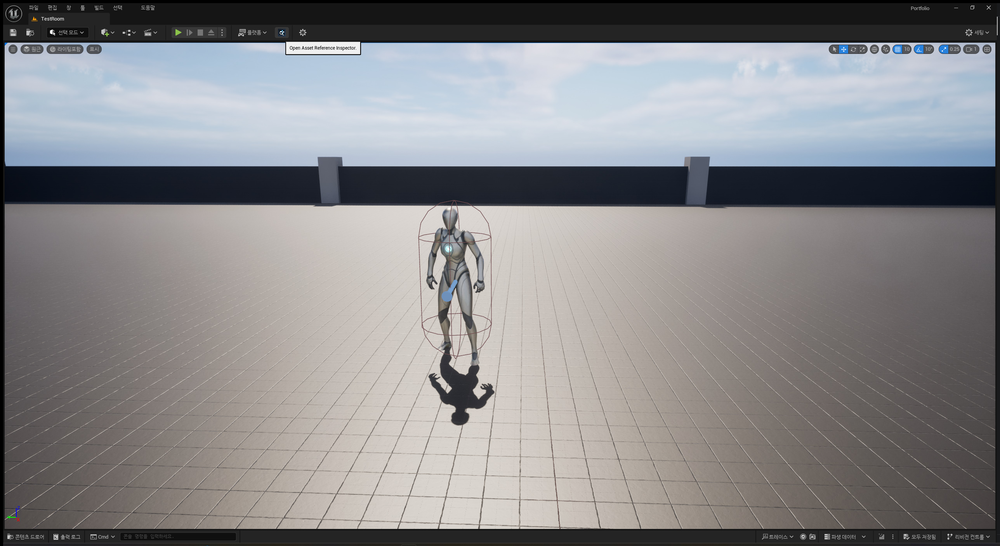
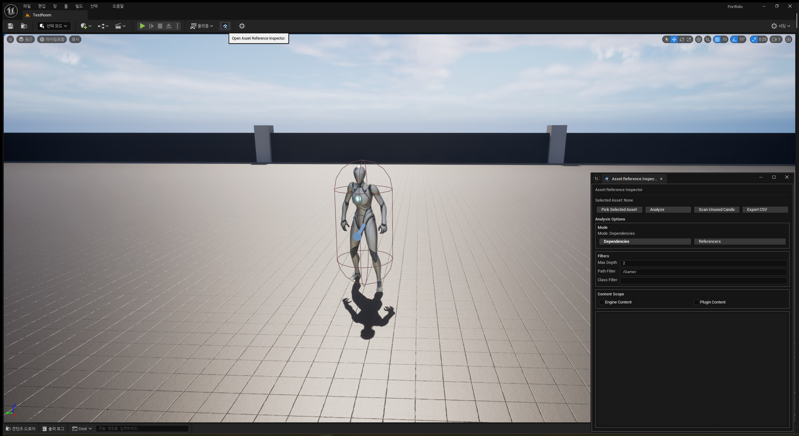

# UE5 Portfolio Pull Request

## 제목

**P54: Asset Reference Inspector Editor Plugin**

## 날짜

**2026.08.02**

## 상태

- [x] `AssetReferenceInspector` Editor-only project plugin 정식 편입
- [x] `창 > Portfolio Tools > Asset Reference Inspector` menu entry 정리
- [x] Asset Registry 기반 dependency / referencer 분석 UI 유지
- [x] Content Browser selected asset pick / sync 동작 유지
- [x] Unused Candidate scan 동작 유지
- [x] CSV export 동작 유지
- [x] plugin README 링크 / 표현 정리
- [x] plugin 기본 icon 추가
- [x] Level Editor toolbar button 추가
- [x] 대표 screenshot evidence 정리
- [x] `PortfolioEditor Win64 Development` build 통과
- [x] `git diff --check` 통과

## 브랜치

- Base: `main`
- Branch: `feature/asset-reference-inspector-plugin`
- Draft PR: 생성 예정

## 대표 스크린샷

### Toolbar button



- Level Editor 상단 toolbar의 `Asset Reference Inspector` button과 tooltip 표시를 확인한다.
- Editor-only plugin 진입점 evidence이며 runtime gameplay 기능 claim으로 사용하지 않는다.

### Nomad panel



- Toolbar button 클릭 후 `Asset Reference Inspector` Nomad panel이 열리는 것을 확인한다.
- Dependency / referencer 분석 UI 진입점과 Asset Registry 기반 inspection panel을 보여준다.

## 요약

이번 PR 후보는 루트 `Plugins/AssetReferenceInspector`를 Portfolio 프로젝트의 Editor-only project plugin으로 정식 편입한다.

핵심은 runtime gameplay 기능을 추가하는 것이 아니라, Unreal Editor 안에서 asset dependency / referencer 관계를 빠르게 확인할 수 있는 편집 도구를 프로젝트에 포함하는 것이다.

Plugin 코드는 `Plugins/AssetReferenceInspector` 아래에 격리한다. Runtime `Portfolio.Build.cs`에 `UnrealEd`, `ToolMenus`, `Slate`, `AssetRegistry` 같은 Editor tooling 의존성을 추가하지 않는다.

## 변경 배경

P53에서 Debug Overlay 조작용 Editor Tooling을 정리하면서, 프로젝트 전용 Editor-only plugin을 관리하는 방향이 확정되었다.

`AssetReferenceInspector`는 Content Browser 선택 asset을 기준으로 참조 관계를 확인하고, unused 후보를 검토하며, 현재 tree 결과를 CSV로 내보내는 Editor tooling이다.

이번 작업에서는 기능을 확장하지 않고, 프로젝트에 정식 편입 가능한 형태로 최소 보정한다.

## 주요 변경

### 1. Editor-only plugin 정식 편입

추가 plugin:

```text
Plugins/AssetReferenceInspector
```

구성:

```text
AssetReferenceInspector.uplugin
README.md
Resources/Icon128.png
Source/AssetReferenceInspector/
```

정책:

- `.uplugin` module type은 `Editor`로 유지한다.
- `CanContainContent: false`로 코드 기반 Editor Tooling만 제공한다.
- `Portfolio.uproject`에는 plugin entry를 추가하지 않는다.
- Runtime module `Portfolio.Build.cs`에는 Editor dependency를 추가하지 않는다.

### 2. Window menu 위치 정리

기존 Window menu entry를 Portfolio 프로젝트 전용 도구 묶음 아래로 정리한다.

```text
창 > Portfolio Tools > Asset Reference Inspector
```

기존 Nomad tab / Slate UI / Asset Registry 분석 기능은 유지한다.

`PortfolioDebugOverlayEditor`와 같은 `Portfolio Tools` 메뉴 그룹을 공유하되, command / tab / menu id는 `AssetReferenceInspector` 기준으로 분리한다.

### 3. Asset Reference Inspector 기능 유지

Nomad panel에서 제공하는 기능:

```text
Pick Selected Asset
Analyze Dependencies
Analyze Referencers
Scan Unused Candidate
Export CSV
Content Browser Sync
```

분석 흐름:

- Content Browser selected asset을 기준으로 시작 asset을 선택한다.
- Asset Registry에서 dependency / referencer 관계를 조회한다.
- Max Depth, Path Filter, Asset Class Filter, Engine / Plugin Content 표시 옵션을 적용한다.
- 결과를 Slate Tree View에 표시한다.
- Tree node double-click 시 Content Browser Sync를 수행한다.
- 현재 Tree 결과는 CSV로 export할 수 있다.

### 4. 기본 icon / toolbar 진입점 추가

Plugin Browser 식별용 기본 icon을 추가하고, Editor UI entry에서 같은 plugin 성격이 드러나도록 연결한다.

```text
Plugins/AssetReferenceInspector/Resources/Icon128.png
```

추가 진입점:

```text
Level Editor toolbar button
```

Toolbar button은 panel open 진입점이다. Asset 분석 실행, CSV export, config 저장을 직접 수행하는 button으로 해석하지 않는다.

### 5. README 정리

`Plugins/AssetReferenceInspector/README.md`를 현재 repo 기준으로 정리한다.

- Window menu 경로를 `창 > Portfolio Tools > Asset Reference Inspector` 기준으로 갱신한다.
- 존재하지 않는 문서 링크를 제거한다.
- Editor-only project plugin 기준을 명시한다.
- Marketplace-ready reusable plugin / runtime gameplay feature / packaged build feature처럼 보이는 표현을 피한다.

## 변경 파일 범위

주요 추가 / 변경:

```text
Docs/04_Pull_Request/P54_UE5_Portfolio_Pull_Request.md
Docs/04_Pull_Request/00_Pull_Request_Index.md
Docs/98_Evidence/01_Screenshot/AssetReferenceInspector/
Plugins/AssetReferenceInspector/
```

커밋 제외:

```text
Plugins/AssetReferenceInspector/Binaries/
Plugins/AssetReferenceInspector/Intermediate/
Plugins/AssetReferenceInspector/Saved/
Saved/AssetReferenceInspector/
generated CSV
```

변경하지 않은 항목:

```text
Portfolio.uproject
Source/Portfolio/Portfolio.Build.cs
Content/
Config/
*.umap
*.uasset
Plugins/PortfolioDebugOverlayEditor/
```

## 검증

### Build

```text
PortfolioEditor Win64 Development
Result: Pass
Date: 2026.08.02
```

### Static check

```text
git diff --check
Result: Pass
```

### Scope check

- `AssetReferenceInspector` plugin은 Editor-only module로 유지된다.
- Runtime gameplay code는 변경하지 않는다.
- `Portfolio.Build.cs`, `Portfolio.uproject`, asset/config 파일은 변경하지 않는다.
- Generated binary/intermediate/saved output과 CSV export 결과는 커밋하지 않는다.

## Evidence 연결

대표 screenshot:

| Evidence | 확인 내용 |
| --- | --- |
| `asset_reference_inspector_01_toolbar_button.jpg` | Level Editor toolbar button과 tooltip 표시 확인 |
| `asset_reference_inspector_02_nomad_panel.jpg` | Toolbar button 클릭 후 Nomad panel open 및 dependency / referencer 분석 UI 진입점 확인 |

Screenshot은 Editor-only tooling 진입점과 panel 표시 evidence로 사용한다. 실제 캡처에서 보이지 않는 CSV export 성공, generated output, packaged/runtime 기능 claim으로 사용하지 않는다.

## 제외 / 보류 항목

- Marketplace-ready reusable plugin claim
- Runtime gameplay feature claim
- Packaged build feature claim
- Plugin preset 저장
- Plugin config 저장
- Node Graph UI
- Soft Reference / Manage Dependency 전용 UI 분리
- Delete-safe unused asset 판정 claim
- 추가 screenshot 촬영 / 패키징

## PR 제출 전 확인

- [x] Editor-only plugin 경계 확인
- [x] Portfolio Tools menu grouping 확인
- [x] README broken link 정리
- [x] 기본 icon 추가
- [x] Toolbar button 표시 확인
- [x] 대표 screenshot evidence 정리
- [x] Build 통과
- [x] `git diff --check` 통과
- [x] Generated output 제외
