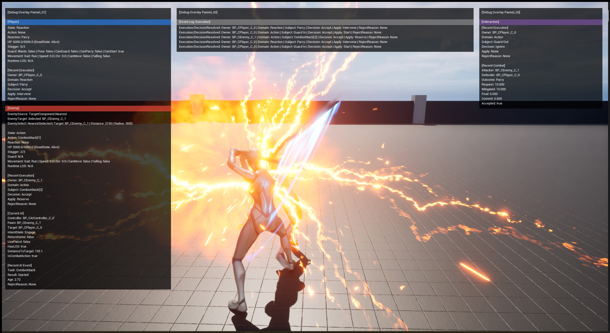

# Project Stellar — UE5.4 C++ Game Programmer Portfolio

`Project Stellar`는 Player와 Enemy가 공유하는 Action / Reaction 실행 구조를 설계하고, 런타임 관찰·검증과 Editor 도구화까지 연결한 Unreal Engine 5.4 3인칭 Action RPG 포트폴리오입니다.

[Web Portfolio](https://razria93.github.io/Portfolio_UE5.4_verGit/) · [Gameplay Video — 업로드 예정](https://github.com/Razria93/Portfolio_UE5.4_verGit/issues/119) · [Portfolio Production Docs](Docs/07_Portfolio_Documents/Portfolio_Production/README.md) · [System Architecture](Docs/05_System_Architecture/00_System_Architecture_Index.md)

> 대표 검증 장면 — 전투 실행 중 Action·Reaction·Target·Facing 상태와 이벤트 기록을 같은 화면에서 대조합니다. 구현 결과를 실시간으로 관찰·검증하는 흐름을 이 포트폴리오의 중심 주제로 삼았습니다. 영상은 [Issue #119](https://github.com/Razria93/Portfolio_UE5.4_verGit/issues/119)에 업로드 예정입니다.

## Project facts

| 항목 | 내용 |
| --- | --- |
| 프로젝트 | UE5.4 기반 3인칭 Action RPG, Project Stellar |
| 기간 / 인원 | 2025.12 ~ 현재 / 1인 개발 |
| 역할 | C++ Game Programmer |
| 직접 기여 | 전투 실행 구조, Enemy AI 참여·관찰, Runtime Debug Overlay, Editor Tooling의 설계·구현·검증 |
| Engine / Language | Unreal Engine 5.4 / C++ · Blueprint |
| 개발 환경 | Windows PC / Visual Studio 2022 |

## 핵심 강점

| 공유 실행 구조 | 런타임 관찰·검증 | 에디터 도구화 |
| --- | --- | --- |
| 요청 수락, 실행 관계, 적용 방식을 분리해 Player와 AI가 같은 실행 계약을 사용합니다. | Focus 대상의 상태와 실행 문맥을 Overlay·Event Log·CSV 근거로 확인합니다. | 반복되는 관찰·참조 조사·Root Motion 변환을 Editor 경로로 정리합니다. |

## 핵심 기술 사례

### 1. Action / Reaction 실행 정책

**문제**: 새 요청이 현재 실행과 공존·연속·개입 중 어떤 관계인지 정하지 않으면, 다음 실행 시점과 기존 실행의 정리 책임이 모호해집니다.

**판단과 구현**: `Decision → Relationship → Apply`를 분리하고, `Independent / Sequential / Exclusive` 관계를 각각 `Start / Reserve / Intervene`으로 적용합니다. 거부·무시 경로도 별도로 유지합니다.

**근거**: [Intervention Policy 상세](https://razria93.github.io/Portfolio_UE5.4_verGit/#intervention-policy) · [Action Orchestrator 코드](Source/Portfolio/Component/CActionOrchestratorComponent.cpp) · [실행 타입 정의](Source/Portfolio/Type/CExecutionTypes.h)

### 2. Focus 기반 Runtime Debug Overlay

**문제**: 전투 중 분산된 Actor 상태와 실행 문맥을 같은 기준으로 대조하지 못하면, 결과 화면만으로는 원인을 확인하기 어렵습니다.

**판단과 구현**: Focus된 Actor의 전투·이동·실행 세션 상태와 Event Log를 읽기 전용 ViewData로 조립해 HUD에 표시합니다. Editor Panel은 session-only CVar 설정과 PIE Focus 요청만 연결하며 게임플레이 상태를 변경하지 않습니다.

**근거**: [Runtime Debug 상세](https://razria93.github.io/Portfolio_UE5.4_verGit/#runtime-debug) · [Overlay Editor 상세](https://razria93.github.io/Portfolio_UE5.4_verGit/#overlay-editor-plugin) · [HUD 코드](Source/Portfolio/Core/Debug/CDebugOverlayHUD.cpp)

### 3. 조사·복구 경로를 갖는 Editor Tooling

**문제**: Asset 관계 조사와 Root Motion 변환은 결과만 남기거나 원본을 바로 변경하면 후속 검토와 복구가 어려워집니다.

**판단과 구현**: Asset Reference Inspector는 Dependencies / Referencers Tree와 unused **검토 후보**를 CSV로 기록합니다. Root Motion Tool은 Apply 전 Track을 검증·백업하고 Revert에서 복구합니다.

**근거**: [Asset Inspector 상세](https://razria93.github.io/Portfolio_UE5.4_verGit/#asset-inspector) · [Root Motion Tool 상세](https://razria93.github.io/Portfolio_UE5.4_verGit/#root-motion-tool) · [Inspector 코드](Plugins/AssetReferenceInspector/Source/AssetReferenceInspector/Private/UI/SAssetReferenceInspectorWidget.cpp) · [Root Motion 코드](Source/PortfolioEditor/Private/Animation/CAnimModifier_TransferBodyMotionToRoot.cpp)

## 결과와 검증 자료

- [Web Portfolio](https://razria93.github.io/Portfolio_UE5.4_verGit/): 현재 제출 기준인 23페이지 HTML의 웹 배포본
- [Gameplay Video Issue #119](https://github.com/Razria93/Portfolio_UE5.4_verGit/issues/119): 대표 영상 업로드 예정. 업로드 후 같은 Issue에서 영상·타임스탬프를 관리
- [Portfolio Production](Docs/07_Portfolio_Documents/Portfolio_Production/README.md): 제출 HTML 원본, 이미지 Assets, publish 규칙
- [System Architecture](Docs/05_System_Architecture/00_System_Architecture_Index.md): 현재 구조와 기술 판단의 문서 색인

## Run locally

1. Unreal Engine **5.4**와 Visual Studio 2022 C++ 개발 환경을 준비합니다.
2. `Portfolio.uproject`를 열고 필요 시 Visual Studio project files를 생성합니다.
3. `PortfolioEditor | Win64 | Development`로 빌드합니다.
4. Editor에서 `TestRoom`을 열어 Player / Enemy 전투와 Debug Overlay 흐름을 확인합니다.

포함된 Editor 플러그인은 `PortfolioDebugOverlayEditor`, `AssetReferenceInspector`입니다. 결과 확인은 [Web Portfolio](https://razria93.github.io/Portfolio_UE5.4_verGit/)와 영상 안내를 우선으로 하며, 로컬 실행은 코드·도구 구조를 더 깊게 검토하기 위한 경로입니다.

## Repository scope

- **공개 범위**: `Source/`, `Config/`, `Plugins/`, `Docs/` 및 프로젝트 구성을 검토하는 데 필요한 파일
- **Unreal binary assets**: 새 `.uasset`, `.umap`은 forward-only Git LFS 정책으로 추적하며, 기존 이력은 변환하지 않습니다.
- **생성·개인 환경 파일**: `Binaries/`, `Build/`, `DerivedDataCache/`, `Intermediate/`, `Saved/`, `.vs/`, `output/` 및 로컬 프로파일링 캡처는 저장소에서 제외합니다.
- **외부 에셋**: 외부 에셋의 재배포 권한은 개별 라이선스로 확인해야 하며, 이 README는 해당 에셋에 별도 라이선스를 부여하지 않습니다.

## Documentation status

현재 제출 기준은 `Portfolio_Production`의 23페이지 HTML과 GitHub Pages입니다. PF00–PF07은 이전 포트폴리오 설계 기록으로 보존합니다.

- [Current submitted portfolio source and publication guide](Docs/07_Portfolio_Documents/Portfolio_Production/README.md)
- [Evidence ledger and documentation maintenance TODO](Docs/01_Work_List/Documentation_Maintenance_TODO.md)
- [Legacy technical notes (PF00–PF07)](Docs/07_Portfolio_Documents/00_Portfolio_Document_Index.md)

## Next evidence update

- Gameplay Video 촬영·업로드 후 Issue #119에 타임스탬프와 장면 설명을 추가합니다.
- DataAsset authoring, Counter / Boss pattern, AI pattern·Runtime LOD의 검증 범위를 후속 확장합니다.
